# Auth Series #6 - Secure Open API (Swagger) calls with Microsoft Entra ID/Azure AD


This is 6th tutorial of the **Auth Series**. Previously in the 5th tutorial - [# Auth Series #5 - Call Microsoft Entra ID/Azure AD Protected Web API via ASP.NET Core MVC using Authorization Code Flow ](https://github.com/mirzaevolution/Uptec-Web-App-Calls-Protected-Api-Authorization-Code-Flow) 
we have created sample protected Todo Api and Todo Web App (ASP.NET Core MVC) and make the web calls the api via Authorization Code Flow to access 
the protected api. 

Now, we want to improve our Todo Api to have an open api a.k.a **Swagger** integrated into the project. So, we can test our api without having to setup any 
client application like we did in 5th tutorial series. 

Enabling Swagger only is not enough. We need to make sure 
that our Swagger can authenticate against the api itself. So, the Swagger will act like the client app to get the token 
to access the api.

That's why we need to register our Swagger to app registration in azure. For those that have not followed our 1st and 2nd tutorials, 
i encourage you to read those first to make sure you have better understanding on how to setup the app registrations.

 - [Auth Series #1 - Microsoft Entra ID/Azure AD Authentication using ASP.NET Core MVC](https://github.com/mirzaevolution/Uptec-Entra-Id-Web-Login)
 - [Auth Series #2 - Protect ASP.NET Core Api with Microsoft Entra ID/Azure AD and Access It via Postman](https://github.com/mirzaevolution/Uptec-Protected-Web-Api)


### 1. Register Swagger as Client Application

If you follow along our 2nd tutorial, we have created two new app registrations:

 - uptec-auth-api: This app registration used by our protected apis previously
 - uptec-auth-api-caller: This app registration used by client apps to call the protected api

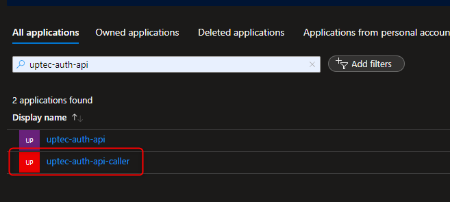

To register our Swagger, make sure you go to the **uptec-auth-api-caller**. In the Overview page, click the Endpoints button and 
take a note on both values of **"OAuth 2.0 authorization endpoint (v2)"** and **"OAuth 2.0 token endpoint (v2)"**. We will need those 
urls in our Swagger to do authentication.

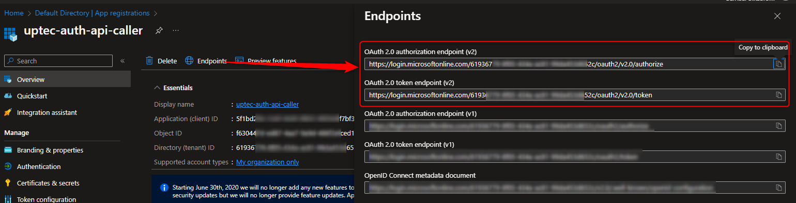

Next, you should go to the **Authentication** page/menu. On that page, click **Add a platform** button (you can follow this only if you haven't created one) and select the 
**"Single-page application"**. 

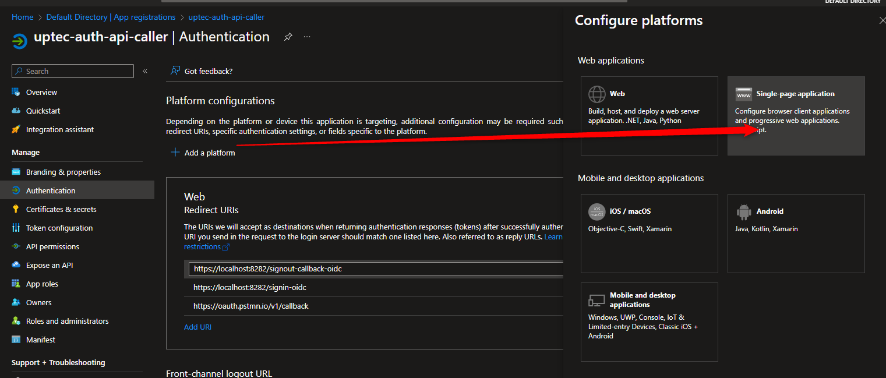

Enter this value in the redirect uris: `https://localhost:8181/swagger/oaut2-redirect.html`. Why do we use port 8181 ? 
In our sample project Todo Api, we used port 8181 in our previous tutorial (5th tutorial). This is optional, if you used different port previously, 
you can adjust based on your setup. 

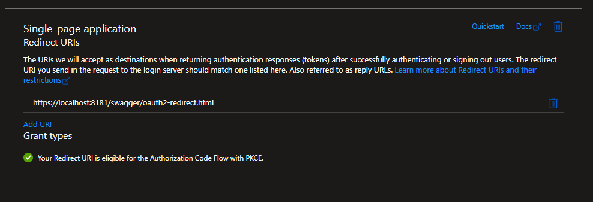

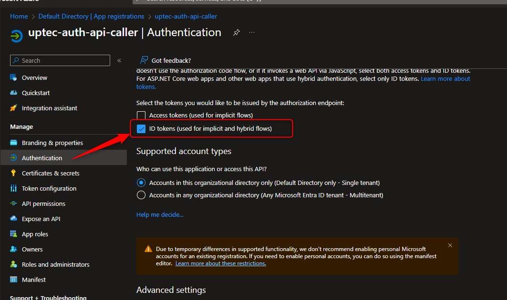

After that, scroll down the page until you find checkbox with label **"ID tokens (used for implicit and hybrid flows)"**. Make sure 
you tick that to enable implicit flow/hybrid flow in our swagger to get the token for authentication. 
Don't forget to hit save after changes we made.

The last step is to take a note on the scopes we created earlier for the API (in the **uptect-auth-api**'s app registration). 
Because in the previous tutorials we have requested the permission inside the **uptect-auth-api-caller**, you don't need to switch to **uptect-auth-api**.
Just go to the API permissions, click the Access.Read & Access.Write permissions and copy the full permission names like in 
the screenshots below.

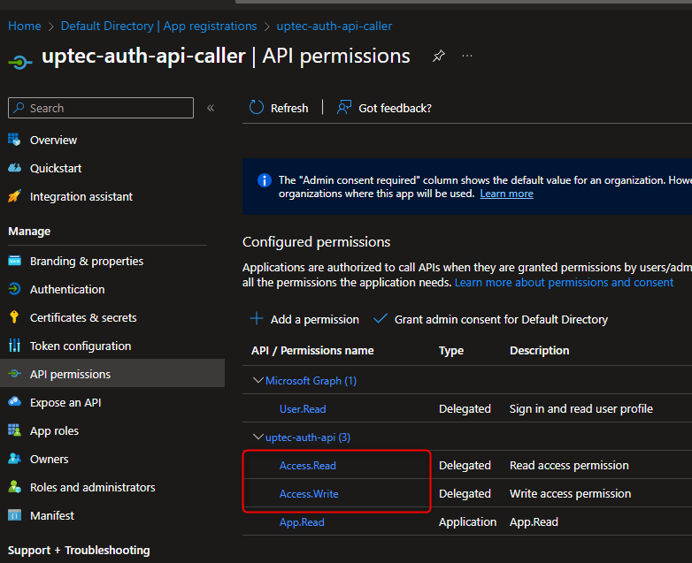


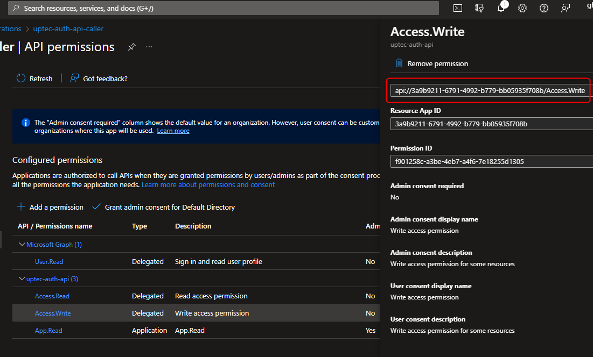

**NB: Make sure you follow previous tutorials to understand how to expose scopes and used them in our api and client apps**

### 2. Integrate Swagger and Configure the Authentication

Because in our Todo Api project we haven't configured the Swagger yet, we need to setup the Swagger first.

Install the `Swashbuckle.AspNetcore` nuget package in our **UptecTodoApi** project.

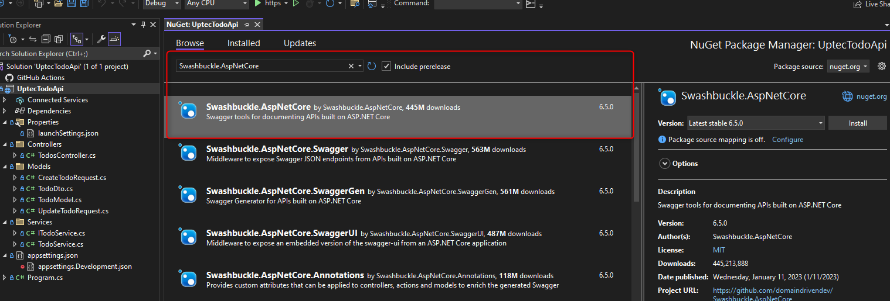

Now, go to the **appsettings.json**, and add this additional config on it for the swagger.

```
  "Swagger": {
    //client id of the caller
    "ClientId": "CALLER_CLIENT_ID",

    //auth endpoint of the caller
    "AuthorizationEndpoint": "https://login.microsoftonline.com/API_TENANT_ID/oauth2/v2.0/authorize",

    //token endpoint of the caller
    "TokenEndpoint": "https://login.microsoftonline.com/API_TENANT_ID/oauth2/v2.0/token",

    //scopes of the api (Access.Read & Access.Write) in full pattern separated by space
    "Scopes": "api://3a9b9211-6791-4992-b779-bb05935f708b/Access.Read api://3a9b9211-6791-4992-b779-bb05935f708b/Access.Write"
  }
```

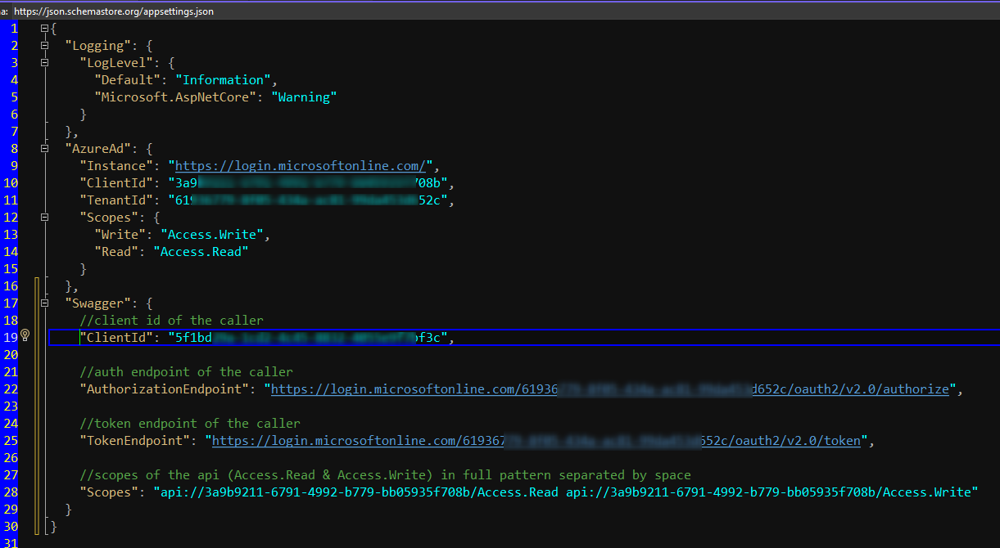

Last step, we need to register the swagger in the Program.cs and configure its auth as well.

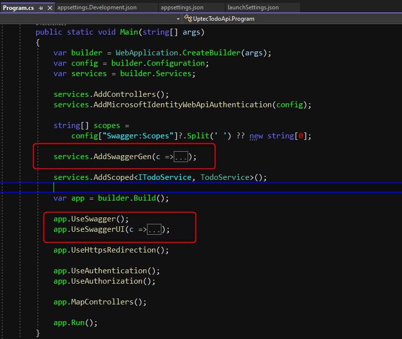

Add these blocks to the service collection part.

-> Configure the SwaggerGen
```
			string[] scopes =
				config["Swagger:Scopes"]?.Split(' ') ?? new string[0];

			services.AddSwaggerGen(c =>
			{
				c.SwaggerDoc("v1", new OpenApiInfo
				{
					Title = "UptecTodoApi",
					Version = "v1",
				});
				c.AddSecurityDefinition("OAuth2", new OpenApiSecurityScheme
				{
					Name = "OAuth2",
					Type = SecuritySchemeType.OAuth2,
					Flows = new OpenApiOAuthFlows
					{
						AuthorizationCode = new OpenApiOAuthFlow
						{
							AuthorizationUrl = new Uri(config["Swagger:AuthorizationEndpoint"] ?? string.Empty),
							TokenUrl = new Uri(config["Swagger:TokenEndpoint"] ?? string.Empty),
							Scopes = scopes?.ToDictionary(c => c)
						}
					}
				});
				c.AddSecurityRequirement(new OpenApiSecurityRequirement
				{
					{
						new OpenApiSecurityScheme
						{
							Reference = new OpenApiReference
							{
								Type = ReferenceType.SecurityScheme, Id = "OAuth2"
							}
						},
						scopes
					}
				});
			});
```

The code above will tell the Swagger that we're going to use Authorization Code Flow with the authorization endpoint and 
token endpoint we got from the previous step. And Swagger will use Scopes we got from API registration (**Access.Read** & **Access.Write**) that listed 
in the **appsettings.json** config.

Add these blocks in the app builder blocks to enable the Swagger UI.

```
			app.UseSwagger();

			app.UseSwaggerUI(c =>
			{
				c.SwaggerEndpoint("/swagger/v1/swagger.json", "Todo Api v1");
				c.OAuthClientId(config["Swagger:ClientId"]);
				c.OAuthUsePkce();
				c.OAuthScopes(scopes);
			});

```
**NB: Details can be seen in the source code in the GitHub**


### 3. Test the Swagger Authentication

Ok, now we are going to test our Swagger. When you run the project, go to /swagger url to open the Swagger UI.

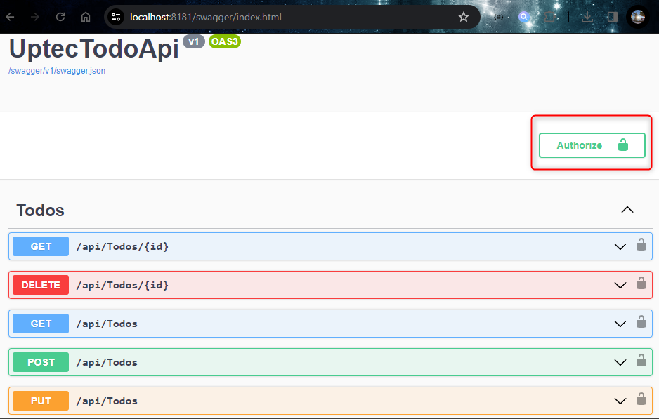

Do you notice Authorize button above? That button used to authenticate our calls. If you don't hit that for authentiation, when you test 
the api, you'll get 401 like in the screenshot below. 

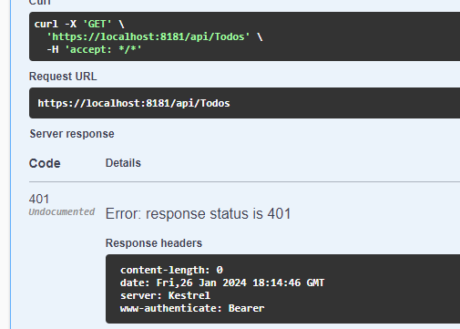

Hit, the authorize button, and select all scopes and then login to your MS Account registered with the Azure.

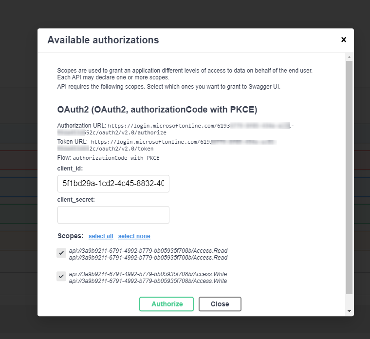

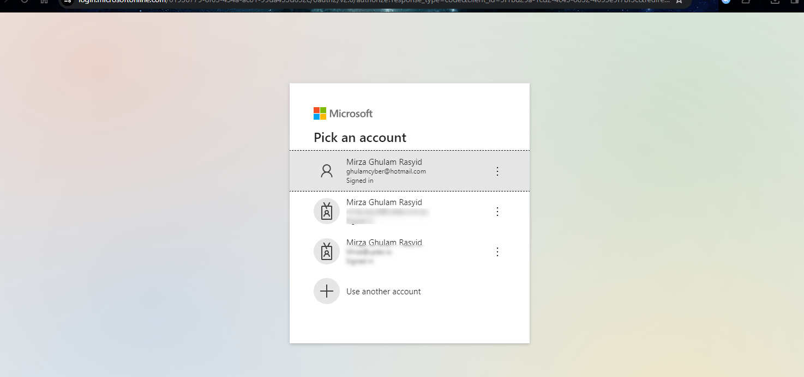

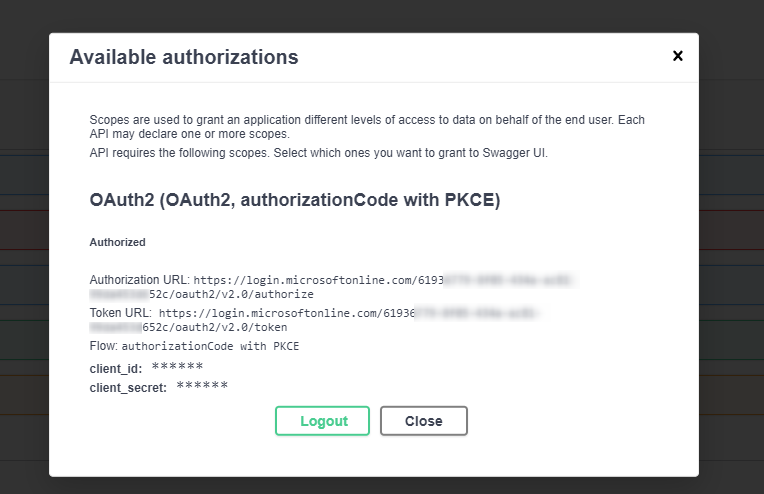


Once completed, let's try to create a post request (create Todo) and then 
try to get all todos.

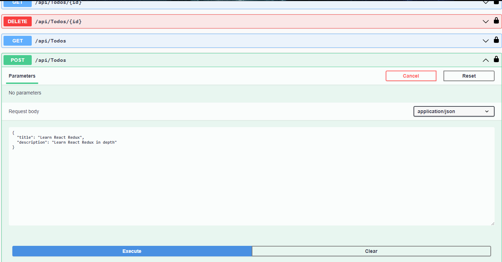

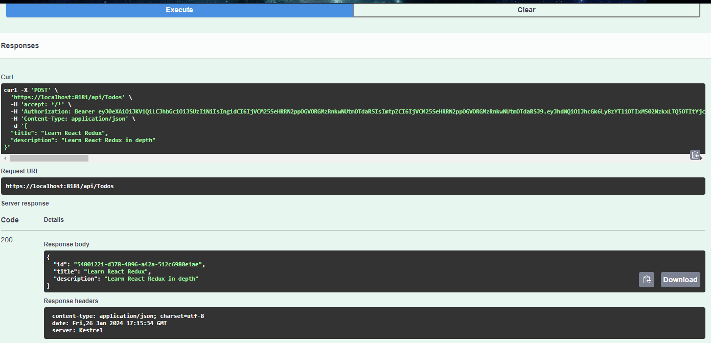

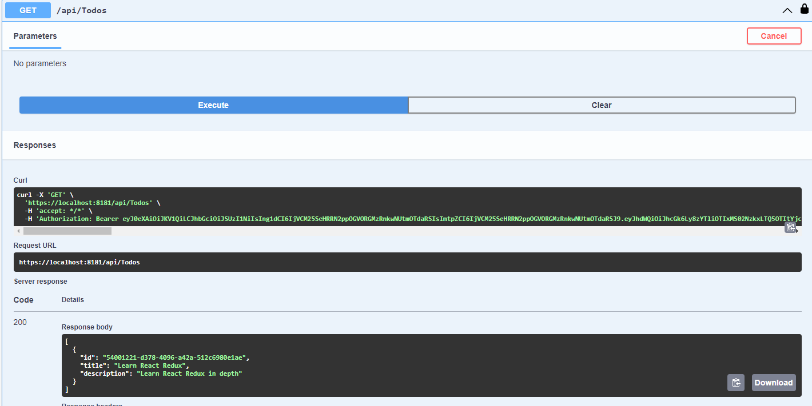

Awesome. Now we can access/test our endpoints without using Postman or other client applications.


Ok, i think that's all for this tutorial. You can check the source code here:

> Todo Api: https://github.com/mirzaevolution/UptecTodoApi


Regards,

**Mirza Ghulam Rasyid**

